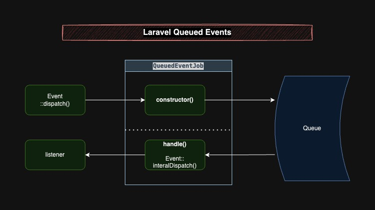

# Laravel Queued Events
[](https://packagist.org/packages/acdphp/laravel-queued-events)

Dispatching Events into queues. This is especially useful for distributed systems events using fanout queues.



## Installation
1. Install the package
    ```shell
    composer require acdphp/laravel-queued-events
    ```
   
## Usage
1. Extend `QueuedEvent` to your event.
   ```php
   use Acdphp\QueuedEvents\Events\QueuedEvent;
  
   class UserCreatedEvent extends QueuedEvent
   {
       // Remove the Dispatchable trait
   
       public function __construct(public $object)
       {
       }
   }
   ```

2. Call `dispatch()`
   ```php
   UserCreatedEvent::dispatch(['foo' => 'bar']);
   ```
   
   - You may specify a queue connection and queue:
   ```php
   UserCreatedEvent::dispatch(['foo' => 'bar'])
       ->onConnection('your-fanout-queue-connection')
       ->onQueue('your-custom-queue');
   ```
  
    - Utilities are also available: `dispatchIf()`, `dispatchUnless()`
    ```php
    // Dispatches if $condition is true
    UserCreatedEvent::dispatchIf($condition, ['foo' => 'bar']);
    
    // Dispatches if $condition is false
    UserCreatedEvent::dispatchUnless($condition, ['foo' => 'bar']);
    ```

3. Default dispatch methods are prefixed with `internal`
   ```php
   UserCreatedEvent::internalDispatch(['foo' => 'bar']);
   
   UserCreatedEvent::internalDispatchIf(['foo' => 'bar']);
   
   UserCreatedEvent::internalDispatchUnless(['foo' => 'bar']);
   ```

## Configuration
- By default, the queue connection will be whatever your `QUEUE_CONNECTION` is set. You may override this by setting `QUEUED_EVENTS_QUEUE_CONNECTION`
- By default, the queue will be `default`. You may override this by setting `QUEUED_EVENTS_QUEUE`
- This config, of course, can be overridden in your code as seen from the usage example or by publishing it:
    ```shell
    php artisan vendor:publish --tag=queued-events-config
    ```

## Notes
- Using all Laravel helper to dispatch except static `::dispatch`, `::dispatchIf` and `::dispatchUnless` will dispatch the job internally. Example `event(...)` or `app('events')->dispatch(...)`.
- Use Laravel's queued listener if you're only using this in a monolithic application. 

## License
The MIT License (MIT). Please see [License File](LICENSE) for more information.
